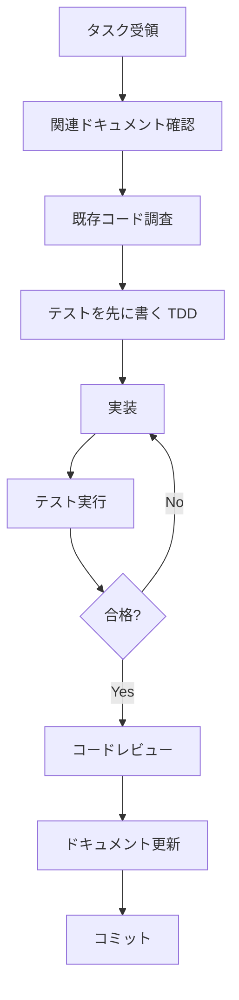

# AI Agents Development Guide

**対象**: AI開発者（Claude、Cursor、GitHub Copilot、ChatGPT等）
**最終更新**: 2025-11-18

このドキュメントは、AIエージェントがcfFormMailerプロジェクトで効率的に作業できるようにするためのガイドです。

---

## 📋 目次

1. [プロジェクト概要](#プロジェクト概要)
2. [コードベース構造](#コードベース構造)
3. [主要な概念と用語](#主要な概念と用語)
4. [タスク別ガイド](#タスク別ガイド)
5. [コーディング規約](#コーディング規約)
6. [テスト方針](#テスト方針)
7. [よくあるパターン](#よくあるパターン)
8. [注意事項](#注意事項)

---

## プロジェクト概要

### 基本情報

```yaml
name: cfFormMailer
type: MODX Evolution Snippet (Mail Form)
version: 1.7.0
php: 7.4 - 8.4
language: PHP
framework: MODX Evolution
license: GPL
created: ~2007
```

### プロジェクトの目的

MODX Evolutionで動作する高機能なメールフォームスニペット。入力検証、メール送信、ファイルアップロード、自動返信等の機能を提供。

### 現在の状態

- **v1.7.0** (安定版): 2,481行の巨大クラス、15年前の設計

---

## コードベース構造

### 現在の構造 (v1.7.x)

```
cfFormMailer/
├── includes/
│   ├── class.cfFormMailer.inc.php  # メインクラス（2,481行）★
│   └── bootstrap.php                # エントリーポイント
├── extras/
│   ├── additionalMethods.inc.php   # カスタム検証・フィルター
│   └── plugin.cfFileView.php       # ファイル表示プラグイン
├── forms/
│   └── sample/                      # サンプルテンプレート
│       ├── config.with_comment.ini
│       ├── web_form.tpl.html
│       └── ...
└── docs/
    ├── REFACTORING_PROPOSAL.md     # リファクタリング設計
    ├── USER_EXPERIENCE_PROPOSAL.md # UX改善提案
    └── ...
```

**★重要**: `class.cfFormMailer.inc.php` が全てのロジックを含む巨大クラス

---
│   ├── Mail/
│   │   ├── MailSender.php
│   │   ├── AdminMailBuilder.php
│   │   └── AutoReplyMailBuilder.php
│   ├── Template/
│   │   ├── TemplateEngine.php
│   │   ├── PlaceholderResolver.php
│   │   └── Filters/
│   ├── Upload/
│   │   ├── FileUploader.php
│   │   ├── UploadedFile.php       # DTO
│   │   ├── FileValidator.php
│   │   └── MimeTypeDetector.php
│   ├── Database/
│   │   └── FormRepository.php
│   └── Legacy/
│       └── Class_cfFormMailer.php # 後方互換ラッパー
├── tests/
│   ├── Unit/
│   └── Integration/
├── config/
├── templates/
├── vendor/                         # Composer依存
└── composer.json
```

---

## 主要な概念と用語

### ドメイン用語

| 用語 | 説明 | コード内の名称 |
|------|------|---------------|
| **フォーム処理フロー** | 入力→確認→送信→完了の4段階 | `$_POST['_mode']` (conf/send) |
| **検証ルール** | 入力値の検証（email, num等19種類） | `valid="1:email,len(-255)"` |
| **プレースホルダ** | テンプレート内の変数 | `[+name+]`, `[+email+]` |
| **フィルター** | プレースホルダの表示整形 | `[+errors\|implodetag(li)+]` |
| **自動返信** | ユーザーへの自動返信メール | `auto_reply=1` |
| **動的送信先** | 選択肢で管理者宛先を変更 | `dynamic_send_to_field` |

---

### 技術用語

| 用語 | 説明 |
|------|------|
| **MODX Evolution** | PHP製CMS（MODx → MODX Evolution → MODX Revolution） |
| **スニペット** | MODXの再利用可能なPHPコード |
| **チャンク** | MODXの再利用可能なHTMLテンプレート |
| **MODxMailer** | MODX付属のメール送信クラス（PHPMailerベース） |
| **cfFormDB** | 別モジュール（送信内容をDB保存） |

---

## タスク別ガイド

### タスク1: 新しい検証ルールを追加

**例**: 郵便番号検証ルール `ZipRule` を追加

#### Step 1: インターフェースを確認

```php
// src/Validation/Rules/ValidationRuleInterface.php
interface ValidationRuleInterface
{
    public function validate(mixed $value, array $params): bool;
    public function getErrorMessage(): string;
    public function transform(mixed $value): mixed;
}
```

#### Step 2: ルールクラスを作成

```php
<?php declare(strict_types=1);
// src/Validation/Rules/ZipRule.php

namespace CfFormMailer\Validation\Rules;

/**
 * 郵便番号検証ルール
 */
class ZipRule implements ValidationRuleInterface
{
    public function validate(mixed $value, array $params): bool
    {
        // 郵便番号形式（123-4567 または 1234567）
        $numbers = str_replace('-', '', $value);
        return strlen($numbers) === 7 && ctype_digit($numbers);
    }

    public function getErrorMessage(): string
    {
        return '正しい郵便番号を入力してください（例: 123-4567）';
    }

    public function transform(mixed $value): string
    {
        // 半角変換 + ハイフン除去 + フォーマット
        $value = mb_convert_kana($value, 'as', 'UTF-8');
        $numbers = str_replace('-', '', $value);

        if (strlen($numbers) === 7) {
            return substr($numbers, 0, 3) . '-' . substr($numbers, 3);
        }

        return $value;
    }
}
```

#### Step 3: テストを作成

```php
<?php
// tests/Unit/Validation/Rules/ZipRuleTest.php

namespace CfFormMailer\Tests\Unit\Validation\Rules;

use PHPUnit\Framework\TestCase;
use CfFormMailer\Validation\Rules\ZipRule;

class ZipRuleTest extends TestCase
{
    private ZipRule $rule;

    protected function setUp(): void
    {
        $this->rule = new ZipRule();
    }

    /** @test */
    public function 有効な郵便番号を受理する(): void
    {
        $this->assertTrue($this->rule->validate('123-4567', []));
        $this->assertTrue($this->rule->validate('1234567', []));
    }

    /** @test */
    public function 無効な郵便番号を拒否する(): void
    {
        $this->assertFalse($this->rule->validate('12-3456', []));
        $this->assertFalse($this->rule->validate('12345678', []));
        $this->assertFalse($this->rule->validate('abc-defg', []));
    }

    /** @test */
    public function 全角数字を半角に変換する(): void
    {
        $result = $this->rule->transform('１２３-４５６７');
        $this->assertEquals('123-4567', $result);
    }

    /** @test */
    public function ハイフンなしをハイフン付きにフォーマット(): void
    {
        $result = $this->rule->transform('1234567');
        $this->assertEquals('123-4567', $result);
    }
}
```

#### Step 4: RuleFactoryに登録

```php
// src/Validation/RuleFactory.php

public function create(string $ruleName): ValidationRuleInterface
{
    return match($ruleName) {
        'email' => new EmailRule(),
        'num' => new NumericRule(),
        'zip' => new ZipRule(),  // ← 追加
        // ...
        default => throw new InvalidRuleException("Unknown rule: {$ruleName}"),
    };
}
```

---

### タスク2: 新しいプレースホルダフィルターを追加

**例**: 電話番号フォーマットフィルター

#### Step 1: インターフェースを確認

```php
// src/Template/Filters/FilterInterface.php
interface FilterInterface
{
    public function apply(mixed $value, string $param): string;
}
```

#### Step 2: フィルタークラスを作成

```php
<?php declare(strict_types=1);
// src/Template/Filters/TelFormatFilter.php

namespace CfFormMailer\Template\Filters;

/**
 * 電話番号フォーマットフィルター
 *
 * 使用例: [+tel|tel_format+]
 * 出力例: 03-1234-5678
 */
class TelFormatFilter implements FilterInterface
{
    public function apply(mixed $value, string $param): string
    {
        if (!is_string($value)) {
            return '';
        }

        // ハイフンを除去
        $numbers = str_replace('-', '', $value);

        if (strlen($numbers) < 10) {
            return $value;
        }

        // 03-XXXX-XXXX 形式
        if (substr($numbers, 0, 2) === '03') {
            return sprintf(
                '%s-%s-%s',
                substr($numbers, 0, 2),
                substr($numbers, 2, 4),
                substr($numbers, 6)
            );
        }

        // 0XX-XXX-XXXX 形式
        return sprintf(
            '%s-%s-%s',
            substr($numbers, 0, 3),
            substr($numbers, 3, 3),
            substr($numbers, 6)
        );
    }
}
```

#### Step 3: FilterRegistryに登録

```php
// src/Template/FilterRegistry.php

public function get(string $filterName): ?FilterInterface
{
    return match($filterName) {
        'implode' => new ImplodeFilter(),
        'dateformat' => new DateFormatFilter(),
        'tel_format' => new TelFormatFilter(),  // ← 追加
        // ...
        default => null,
    };
}
```

---

### タスク3: レガシーコードのリファクタリング

**例**: `_def_email()` メソッドを `EmailRule` クラスに分離

#### Before (v1.7.x)

```php
// includes/class.cfFormMailer.inc.php (2,481行)

private function _def_email($value, $param, $field)
{
    // 強制的に半角に変換
    $this->form[$field] = mb_convert_kana(
        $this->form[$field] ?? '',
        'a',
        $this->config('charset')
    );

    if ($this->_isValidEmail($this->form[$field])) {
        return true;
    }

    return 'メールアドレスの形式が正しくありません';
}
```

---

## コーディング規約

### PSR準拠

- **PSR-1**: 基本コーディング規約
- **PSR-4**: オートローディング規約
- **PSR-12**: 拡張コーディングスタイル

### 名前空間

```php
namespace CfFormMailer\{Layer}\{Component};

// 例:
namespace CfFormMailer\Validation\Rules;
namespace CfFormMailer\Template\Filters;
namespace CfFormMailer\Mail;
```

### クラス名

- **PascalCase**
- 単数形（例: `EmailRule` ではなく `EmailRules` ×）
- 意図が明確な名前

```php
// ✅ Good
class EmailRule {}
class FormValidator {}
class MailSender {}

// ❌ Bad
class Email {}        // 曖昧
class Validator {}    // 汎用的すぎる
class Mail {}         // 何をするクラスか不明
```

### メソッド名

- **camelCase**
- 動詞で始める

```php
// ✅ Good
public function validate(array $data): ValidationResult
public function sendMail(array $formData): bool
public function getErrorMessage(): string

// ❌ Bad
public function validation()  // 名詞
public function mail()        // 曖昧
public function error()       // 動詞がない
```

### 型宣言

**厳格な型宣言を必須とする**

```php
<?php declare(strict_types=1);  // ファイル先頭に必須

namespace CfFormMailer\Validation;

class FormValidator
{
    // プロパティに型宣言
    private array $rules = [];
    private ?ValidationResult $lastResult = null;

    // パラメータと戻り値に型宣言
    public function validate(array $data): ValidationResult
    {
        // ...
    }

    // Nullable型
    public function getLastError(): ?string
    {
        return $this->lastResult?->getFirstError();
    }
}
```

### PHPDoc

**型宣言だけで表現できない情報を補足**

```php
/**
 * フォーム入力値を検証
 *
 * @param array<string, mixed> $data 検証対象データ
 * @return ValidationResult 検証結果（エラー情報を含む）
 * @throws ConfigException 検証ルールの設定が不正な場合
 */
public function validate(array $data): ValidationResult
{
    // ...
}
```

---

## テスト方針

### テストカバレッジ目標

| レイヤー | 目標カバレッジ |
|---------|--------------|
| Validation | 100% |
| Template | 95% |
| Mail | 90% |
| Core | 85% |
| 全体 | 90%+ |

### テストの命名規則

```php
<?php
namespace CfFormMailer\Tests\Unit\Validation\Rules;

use PHPUnit\Framework\TestCase;

class EmailRuleTest extends TestCase
{
    /** @test */
    public function 有効なメールアドレスを受理する(): void
    {
        // Arrange
        $rule = new EmailRule();

        // Act
        $result = $rule->validate('test@example.com', []);

        // Assert
        $this->assertTrue($result);
    }

    /** @test */
    public function 無効なメールアドレスを拒否する(): void
    {
        $rule = new EmailRule();

        $this->assertFalse($rule->validate('invalid', []));
        $this->assertFalse($rule->validate('test@', []));
        $this->assertFalse($rule->validate('@example.com', []));
    }
}
```

**命名規則**:
- テストクラス: `{ClassName}Test`
- テストメソッド: 日本語でテスト内容を明示（`@test`アノテーション使用）
- Arrange-Act-Assert パターン

---

## よくあるパターン

### パターン1: DTOクラス

**不変オブジェクトとして実装**

```php
<?php declare(strict_types=1);

namespace CfFormMailer\Validation;

/**
 * 検証結果DTO（不変オブジェクト）
 */
final class ValidationResult
{
    public function __construct(
        private readonly array $errors,
        private readonly array $validatedData
    ) {}

    public function isValid(): bool
    {
        return empty($this->errors);
    }

    public function getErrors(): array
    {
        return $this->errors;
    }

    public function getValidatedData(): array
    {
        return $this->validatedData;
    }

    public function getFirstError(): ?string
    {
        $firstField = array_key_first($this->errors);
        return $firstField ? $this->errors[$firstField][0] : null;
    }
}
```

### パターン2: ファクトリクラス

```php
<?php declare(strict_types=1);

namespace CfFormMailer\Validation;

class RuleFactory
{
    private array $customRules = [];

    public function create(string $ruleName): ValidationRuleInterface
    {
        // カスタムルール優先
        if (isset($this->customRules[$ruleName])) {
            return $this->customRules[$ruleName];
        }

        // 標準ルール
        return match($ruleName) {
            'required' => new Rules\RequiredRule(),
            'email' => new Rules\EmailRule(),
            'num' => new Rules\NumericRule(),
            // ...
            default => throw new InvalidRuleException(
                "Unknown validation rule: {$ruleName}"
            ),
        };
    }

    public function register(string $name, ValidationRuleInterface $rule): void
    {
        $this->customRules[$name] = $rule;
    }
}
```

### パターン3: 例外クラス

```php
<?php declare(strict_types=1);

namespace CfFormMailer\Validation\Exceptions;

use RuntimeException;

/**
 * 検証エラー例外
 */
class ValidationException extends RuntimeException
{
    public function __construct(
        string $message,
        private readonly array $errors = []
    ) {
        parent::__construct($message);
    }

    public function getErrors(): array
    {
        return $this->errors;
    }
}
```

---

## 注意事項

### ⚠️ 後方互換性の維持

**後方互換性の維持が重要**

```php
// ❌ 削除してはいけない
// includes/class.cfFormMailer.inc.php の public メソッド

// ✅ レガシーラッパーとして残す
// src/Legacy/Class_cfFormMailer.php
```

### ⚠️ MODX依存の扱い

**MODX固有の機能は抽象化**

```php
// ❌ Bad: MODXに直接依存
global $modx;
$modx->parseDocumentSource($content);

// ✅ Good: インターフェース経由
interface ModxInterface
{
    public function parseDocumentSource(string $content): string;
}

class TemplateEngine
{
    public function __construct(
        private ModxInterface $modx
    ) {}
}
```

### ⚠️ セキュリティ

**重要なセキュリティ対策**

1. **入力検証**: すべての外部入力を検証
2. **出力エスケープ**: HTMLへの出力は必ずエスケープ
3. **CSRFトークン**: フォーム送信時に検証
4. **ファイルアップロード**: MIMEタイプを検証
5. **SQLインジェクション**: プリペアドステートメント使用

```php
// ✅ Good
$stmt = $db->prepare('SELECT * FROM users WHERE email = ?');
$stmt->execute([$email]);

// ❌ Bad
$sql = "SELECT * FROM users WHERE email = '{$email}'";
```

---

## 推奨開発フロー



---

## 参考ドキュメント

### 必読

1. **INSTALLATION.md** - インストール手順
2. **CHANGELOG.md** - 更新履歴
3. **README.md** - プロジェクト概要

### その他

- **INSTALLATION.md** - インストール手順
- **CHANGELOG.md** - 更新履歴
- **README.md** - プロジェクト概要

---

## Quick Reference

### よく使うコマンド

```bash
# Composer autoload再生成
composer dump-autoload

# テスト実行（全て）
vendor/bin/phpunit

# テスト実行（特定クラス）
vendor/bin/phpunit tests/Unit/Validation/Rules/EmailRuleTest.php

# カバレッジレポート生成
vendor/bin/phpunit --coverage-html coverage

# 静的解析
vendor/bin/phpstan analyse src
```

### ファイル生成テンプレート

**新しい検証ルール**:
```bash
src/Validation/Rules/{RuleName}Rule.php
tests/Unit/Validation/Rules/{RuleName}RuleTest.php
```

**新しいフィルター**:
```bash
src/Template/Filters/{FilterName}Filter.php
tests/Unit/Template/Filters/{FilterName}FilterTest.php
```

---

**Happy Coding with AI! 🤖✨**

---

**文書バージョン**: 1.0
**最終更新**: 2025-11-18
**作成者**: Claude (Sonnet 4.5)
