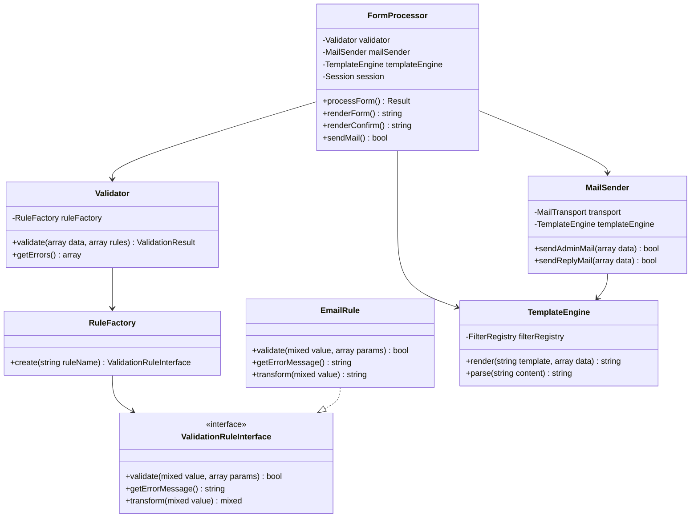
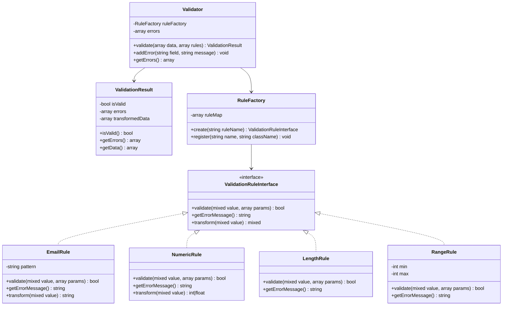
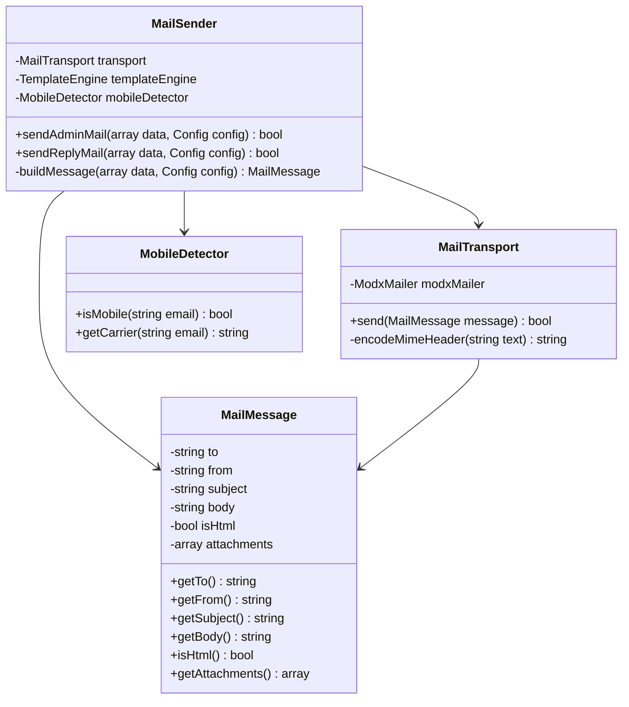
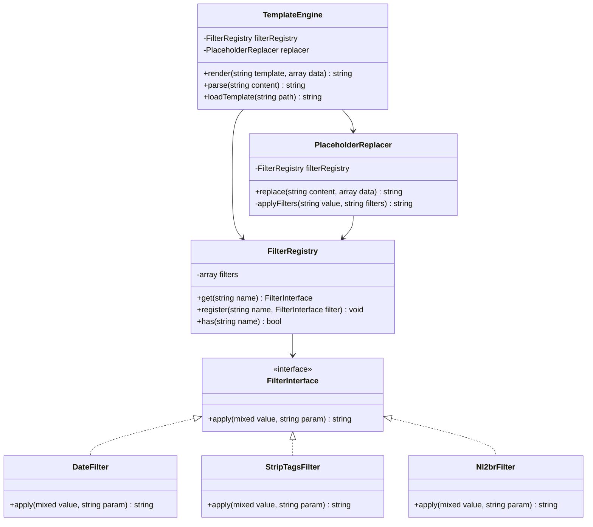
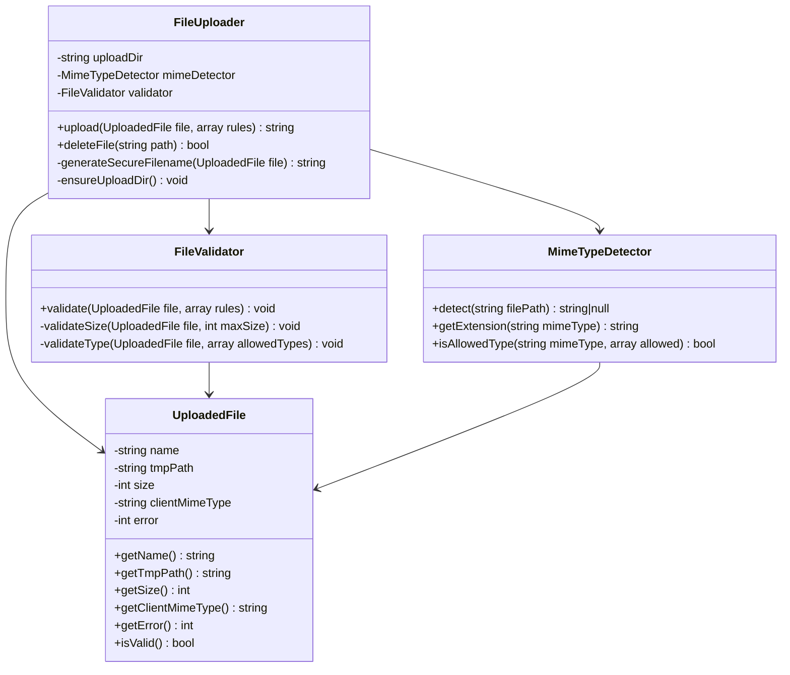
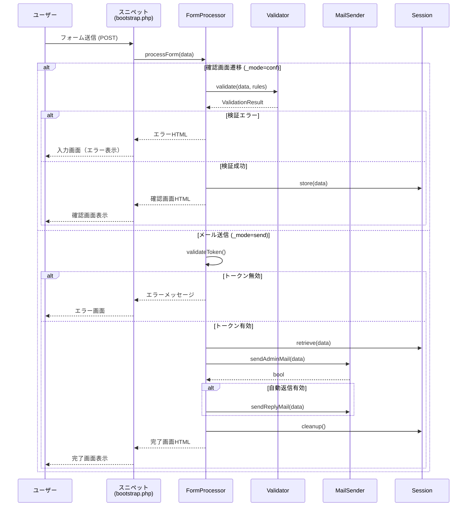
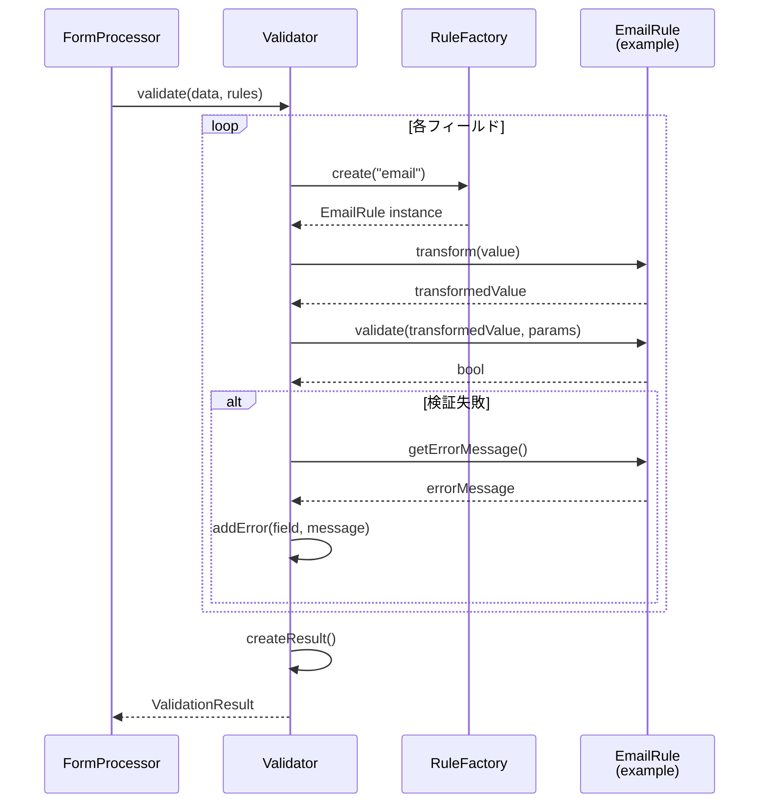
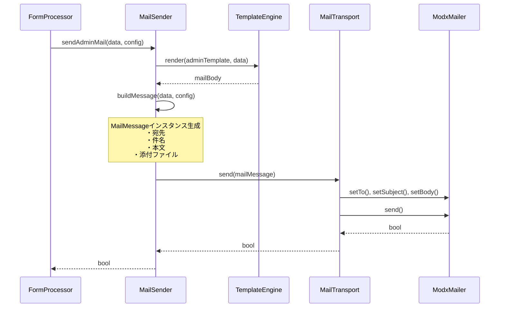
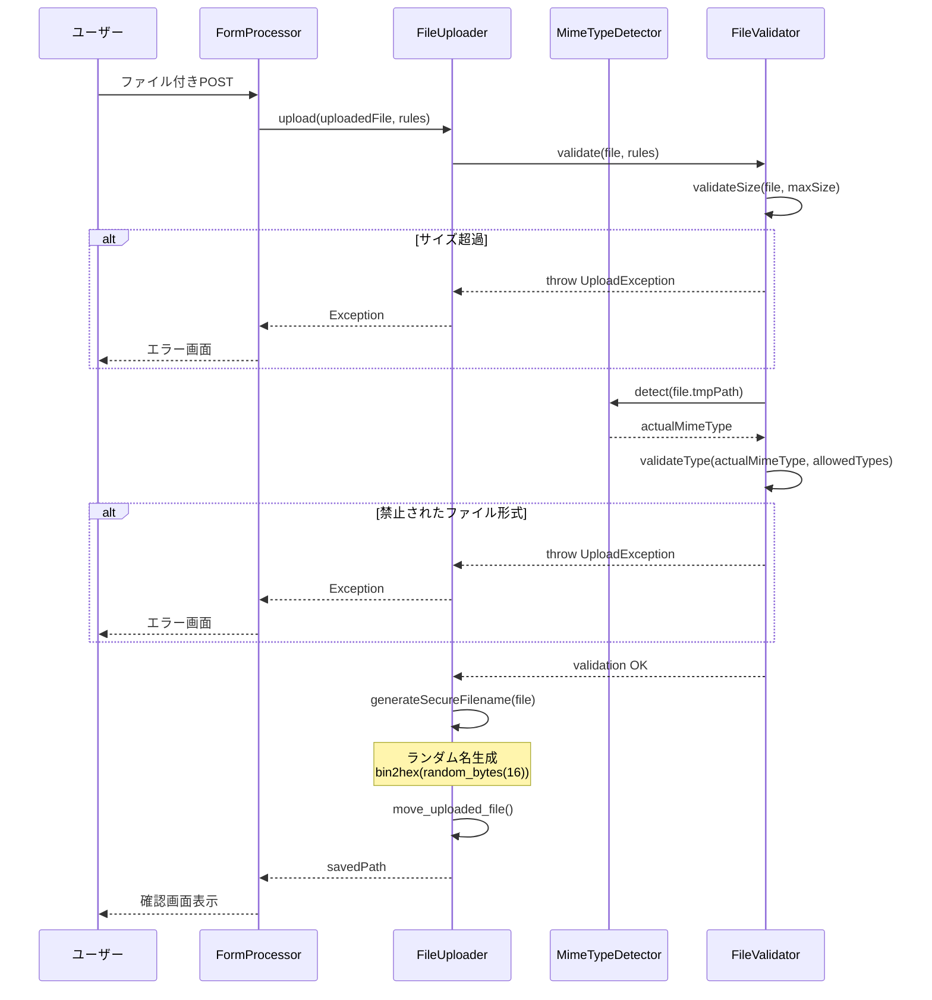

# アーキテクチャ設計書

cfFormMailer v2.0のアーキテクチャ設計を詳細に説明します。

---

## 📋 目次

1. [アーキテクチャ概要](#アーキテクチャ概要)
2. [ディレクトリ構造](#ディレクトリ構造)
3. [クラス図](#クラス図)
4. [シーケンス図](#シーケンス図)
5. [詳細クラス設計](#詳細クラス設計)
6. [デザインパターン](#デザインパターン)
7. [データフロー](#データフロー)
8. [セキュリティ設計](#セキュリティ設計)

---

## アーキテクチャ概要

### v1.7 (現在)

```
┌─────────────────────────────────────┐
│  Class_cfFormMailer (2,481 lines)  │
│  ・81 methods                        │
│  ・10+ responsibilities              │
│  ・No type declarations              │
│  ・No dependency injection           │
└─────────────────────────────────────┘
```

**問題点**:
- 単一責任原則違反（バリデーション、メール送信、テンプレート処理など全てが1クラス）
- テスト困難（依存関係のハードコーディング）
- 型安全性なし（PHP 8.x動的プロパティ問題）
- 拡張困難（新機能追加時に巨大クラスを編集）

### v2.0 (目標)

```
┌──────────────┐     ┌──────────────┐     ┌──────────────┐
│  Validation  │     │     Mail     │     │   Template   │
│   Module     │     │    Module    │     │    Module    │
│              │     │              │     │              │
│ • Validator  │     │ • MailSender │     │ • Engine     │
│ • RuleFactory│     │ • Message    │     │ • Renderer   │
│ • 19 Rules   │     │ • Transport  │     │ • Filters    │
└──────────────┘     └──────────────┘     └──────────────┘
        │                    │                    │
        └────────────────────┼────────────────────┘
                             │
                    ┌────────▼────────┐
                    │   Core Module   │
                    │                 │
                    │ • FormProcessor │
                    │ • Config        │
                    │ • Session       │
                    └─────────────────┘
                             │
                    ┌────────▼────────┐
                    │ Legacy Wrapper  │
                    │ (100% backward  │
                    │  compatibility) │
                    └─────────────────┘
```

**利点**:
- 各モジュールが独立（単体テスト可能）
- 型安全（すべてのクラスに`declare(strict_types=1)`）
- 依存性注入（モックによるテスト容易）
- 拡張容易（新ルールは新クラス追加のみ）

---

## ディレクトリ構造

```
cfFormMailer/
├── src/                          # v2.0 新規コード
│   ├── Core/                     # コアロジック
│   │   ├── FormProcessor.php    # フォーム処理フロー統括
│   │   ├── Config.php            # 設定読み込み・パース
│   │   └── Session.php           # セッション管理
│   │
│   ├── Validation/               # バリデーション層
│   │   ├── Validator.php         # バリデーター本体
│   │   ├── ValidationResult.php  # 結果DTO
│   │   ├── RuleFactory.php       # ルール生成工場
│   │   └── Rules/                # 19個の検証ルール
│   │       ├── ValidationRuleInterface.php
│   │       ├── EmailRule.php
│   │       ├── NumericRule.php
│   │       ├── LengthRule.php
│   │       └── ...
│   │
│   ├── Mail/                     # メール送信層
│   │   ├── MailSender.php        # メール送信統括
│   │   ├── MailMessage.php       # メッセージDTO
│   │   ├── MailTransport.php     # MODX PHPMailer連携
│   │   └── MobileDetector.php    # 携帯判定
│   │
│   ├── Template/                 # テンプレート層
│   │   ├── TemplateEngine.php    # テンプレートエンジン
│   │   ├── PlaceholderReplacer.php
│   │   ├── FilterRegistry.php    # フィルター管理
│   │   └── Filters/              # テンプレートフィルター
│   │       ├── FilterInterface.php
│   │       ├── DateFilter.php
│   │       ├── StripTagsFilter.php
│   │       └── ...
│   │
│   ├── Upload/                   # ファイルアップロード層
│   │   ├── FileUploader.php      # アップロード処理
│   │   ├── UploadedFile.php      # ファイルDTO
│   │   ├── MimeTypeDetector.php  # MIME判定
│   │   └── FileValidator.php     # ファイル検証
│   │
│   ├── Database/                 # DB連携層
│   │   ├── FormDataRepository.php
│   │   └── DatabaseConnection.php
│   │
│   └── Legacy/                   # v1.7互換層
│       └── LegacyFormMailer.php  # 旧クラスのラッパー
│
├── includes/                     # v1.7 既存コード
│   ├── class.cfFormMailer.inc.php  # 2,481行の旧クラス
│   └── bootstrap.php             # エントリーポイント
│
├── tests/                        # テストコード
│   ├── Unit/                     # 単体テスト
│   │   ├── Validation/
│   │   │   └── Rules/
│   │   ├── Mail/
│   │   └── Template/
│   └── Integration/              # 統合テスト
│
├── config/                       # 設定ファイル
│   └── validation_rules.php     # ルール定義
│
├── docs/                         # ドキュメント
│   ├── ARCHITECTURE.md          # 本ファイル
│   ├── REFACTORING_PROPOSAL.md
│   ├── MIGRATION_GUIDE.md
│   ├── AGENTS.md
│   └── ...
│
├── composer.json                 # Composer設定
├── phpunit.xml                   # PHPUnit設定
└── phpstan.neon                  # PHPStan設定
```

---

## クラス図

### 全体構成



### Validation層の詳細



### Mail層の詳細



### Template層の詳細



### Upload層の詳細



---

## シーケンス図

### フォーム送信の全体フロー



### バリデーション処理の詳細



### メール送信処理の詳細



### ファイルアップロード処理



---

## 詳細クラス設計

### Core: FormProcessor

フォーム処理フローを統括するメインクラス。

```php
<?php declare(strict_types=1);

namespace CfFormMailer\Core;

use CfFormMailer\Validation\Validator;
use CfFormMailer\Mail\MailSender;
use CfFormMailer\Template\TemplateEngine;
use CfFormMailer\Upload\FileUploader;

/**
 * フォーム処理フロー統括クラス
 */
class FormProcessor
{
    private Validator $validator;
    private MailSender $mailSender;
    private TemplateEngine $templateEngine;
    private Session $session;
    private Config $config;
    private ?FileUploader $fileUploader = null;

    public function __construct(
        Validator $validator,
        MailSender $mailSender,
        TemplateEngine $templateEngine,
        Session $session,
        Config $config,
        ?FileUploader $fileUploader = null
    ) {
        $this->validator = $validator;
        $this->mailSender = $mailSender;
        $this->templateEngine = $templateEngine;
        $this->session = $session;
        $this->config = $config;
        $this->fileUploader = $fileUploader;
    }

    /**
     * フォームデータを処理
     *
     * @param array<string, mixed> $postData POSTデータ
     * @return ProcessResult 処理結果
     */
    public function processForm(array $postData): ProcessResult
    {
        // 実装...
    }

    /**
     * 入力画面をレンダリング
     */
    public function renderForm(?array $errors = null): string
    {
        $template = $this->config->get('tmpl_input');
        $data = $this->session->retrieve('form_data') ?? [];

        return $this->templateEngine->render($template, [
            'data' => $data,
            'errors' => $errors ?? [],
            'token' => $this->session->generateToken(),
        ]);
    }

    /**
     * 確認画面をレンダリング
     */
    public function renderConfirm(array $data): string
    {
        $template = $this->config->get('tmpl_conf');

        return $this->templateEngine->render($template, [
            'data' => $data,
            'token' => $this->session->getToken(),
        ]);
    }

    /**
     * 完了画面をレンダリング
     */
    public function renderComplete(): string
    {
        $template = $this->config->get('tmpl_comp');

        return $this->templateEngine->render($template, []);
    }

    /**
     * メール送信
     */
    public function sendMail(array $data): bool
    {
        $sent = $this->mailSender->sendAdminMail($data, $this->config);

        if ($sent && $this->config->get('auto_reply')) {
            $this->mailSender->sendReplyMail($data, $this->config);
        }

        return $sent;
    }

    /**
     * トークン検証
     */
    public function isValidToken(string $token): bool
    {
        return $this->session->validateToken($token);
    }
}
```

**責務**:
- フォーム送信フローの制御
- 各レイヤー（Validation, Mail, Template）の調整
- セッション管理の委譲
- 画面レンダリングの統括

**依存関係**:
- `Validator`: 入力検証
- `MailSender`: メール送信
- `TemplateEngine`: テンプレート処理
- `Session`: セッション管理
- `Config`: 設定読み込み

---

### Validation: Validator

```php
<?php declare(strict_types=1);

namespace CfFormMailer\Validation;

/**
 * フォームデータのバリデーター
 */
class Validator
{
    private RuleFactory $ruleFactory;
    private array $errors = [];

    public function __construct(RuleFactory $ruleFactory)
    {
        $this->ruleFactory = $ruleFactory;
    }

    /**
     * データを検証
     *
     * @param array<string, mixed> $data 検証対象データ
     * @param array<string, string> $rules フィールドごとのルール定義
     * @return ValidationResult 検証結果
     */
    public function validate(array $data, array $rules): ValidationResult
    {
        $this->errors = [];
        $transformedData = [];

        foreach ($rules as $field => $ruleString) {
            $value = $data[$field] ?? null;

            // ルール文字列をパース: "1:email,len(-255)"
            $parsed = $this->parseRuleString($ruleString);
            $isRequired = $parsed['required'];
            $ruleNames = $parsed['rules'];

            // 必須チェック
            if ($isRequired && $this->isEmpty($value)) {
                $this->addError($field, '入力必須項目です');
                continue;
            }

            // 空の場合はスキップ（必須でない）
            if ($this->isEmpty($value)) {
                $transformedData[$field] = $value;
                continue;
            }

            // 各ルールを適用
            foreach ($ruleNames as $ruleName => $params) {
                $rule = $this->ruleFactory->create($ruleName);

                // データ変換（全角→半角など）
                $value = $rule->transform($value);

                // 検証
                if (!$rule->validate($value, $params)) {
                    $this->addError($field, $rule->getErrorMessage());
                    break;
                }
            }

            $transformedData[$field] = $value;
        }

        return new ValidationResult(
            empty($this->errors),
            $this->errors,
            $transformedData
        );
    }

    /**
     * ルール文字列をパース
     *
     * @param string $ruleString 例: "1:email,len(-255)"
     * @return array{required: bool, rules: array}
     */
    private function parseRuleString(string $ruleString): array
    {
        // 実装省略
    }

    private function isEmpty(mixed $value): bool
    {
        return $value === null || $value === '' || $value === [];
    }

    private function addError(string $field, string $message): void
    {
        $this->errors[$field] = $message;
    }

    public function getErrors(): array
    {
        return $this->errors;
    }
}
```

---

### Validation: ValidationRuleInterface

```php
<?php declare(strict_types=1);

namespace CfFormMailer\Validation\Rules;

/**
 * バリデーションルールのインターフェース
 */
interface ValidationRuleInterface
{
    /**
     * 値を検証
     *
     * @param mixed $value 検証対象の値
     * @param array $params ルールのパラメータ（例: len(-255) なら ['-255']）
     * @return bool 検証成功ならtrue
     */
    public function validate(mixed $value, array $params): bool;

    /**
     * エラーメッセージを取得
     *
     * @return string 日本語エラーメッセージ
     */
    public function getErrorMessage(): string;

    /**
     * 値を変換（正規化）
     *
     * 例: 全角英数字→半角、前後の空白削除など
     *
     * @param mixed $value 変換対象の値
     * @return mixed 変換後の値
     */
    public function transform(mixed $value): mixed;
}
```

**実装例**: `EmailRule`

```php
<?php declare(strict_types=1);

namespace CfFormMailer\Validation\Rules;

class EmailRule implements ValidationRuleInterface
{
    private const PATTERN = "/^(?:[a-z0-9+_-]+?\.)*?[a-z0-9_+-]+?@(?:[a-z0-9_-]+?\.)*?[a-z0-9_-]+?\.[a-z0-9]{2,5}$/i";

    public function validate(mixed $value, array $params): bool
    {
        if (!is_string($value)) {
            return false;
        }

        return (bool) preg_match(self::PATTERN, $value);
    }

    public function getErrorMessage(): string
    {
        return 'メールアドレスの形式が正しくありません';
    }

    public function transform(mixed $value): mixed
    {
        if (!is_string($value)) {
            return $value;
        }

        // 全角英数字→半角
        return mb_convert_kana($value, 'a', 'UTF-8');
    }
}
```

---

### Mail: MailSender

```php
<?php declare(strict_types=1);

namespace CfFormMailer\Mail;

use CfFormMailer\Template\TemplateEngine;
use CfFormMailer\Core\Config;

/**
 * メール送信統括クラス
 */
class MailSender
{
    private MailTransport $transport;
    private TemplateEngine $templateEngine;
    private MobileDetector $mobileDetector;

    public function __construct(
        MailTransport $transport,
        TemplateEngine $templateEngine,
        MobileDetector $mobileDetector
    ) {
        $this->transport = $transport;
        $this->templateEngine = $templateEngine;
        $this->mobileDetector = $mobileDetector;
    }

    /**
     * 管理者宛メールを送信
     *
     * @param array<string, mixed> $data フォームデータ
     * @param Config $config 設定
     * @return bool 送信成功ならtrue
     */
    public function sendAdminMail(array $data, Config $config): bool
    {
        $template = $config->get('tmpl_mail_admin');
        $body = $this->templateEngine->render($template, $data);

        $message = new MailMessage(
            to: $config->get('admin_mail'),
            from: $config->get('admin_mailfrom') ?? $config->get('admin_mail'),
            subject: $config->get('admin_subject'),
            body: $body,
            isHtml: (bool) $config->get('admin_ishtml', false)
        );

        // CC, BCC
        if ($cc = $config->get('admin_mail_cc')) {
            $message->setCc($cc);
        }
        if ($bcc = $config->get('admin_mail_bcc')) {
            $message->setBcc($bcc);
        }

        // 添付ファイル
        if ($attachments = $config->get('attach_file')) {
            foreach ((array) $attachments as $file) {
                $message->addAttachment($file);
            }
        }

        return $this->transport->send($message);
    }

    /**
     * 自動返信メールを送信
     */
    public function sendReplyMail(array $data, Config $config): bool
    {
        $replyToField = $config->get('reply_to');
        $recipientEmail = $data[$replyToField] ?? null;

        if (!$recipientEmail || !filter_var($recipientEmail, FILTER_VALIDATE_EMAIL)) {
            return false;
        }

        // 携帯判定
        $isMobile = $this->mobileDetector->isMobile($recipientEmail);
        $templateKey = $isMobile ? 'tmpl_mail_reply_mobile' : 'tmpl_mail_reply';
        $template = $config->get($templateKey) ?? $config->get('tmpl_mail_reply');

        $body = $this->templateEngine->render($template, $data);

        $message = new MailMessage(
            to: $recipientEmail,
            from: $config->get('admin_mail'),
            subject: $config->get('reply_subject'),
            body: $body,
            isHtml: (bool) $config->get('reply_ishtml', false)
        );

        if ($fromName = $config->get('reply_fromname')) {
            $message->setFromName($fromName);
        }

        return $this->transport->send($message);
    }
}
```

---

### Template: TemplateEngine

```php
<?php declare(strict_types=1);

namespace CfFormMailer\Template;

/**
 * テンプレートエンジン
 */
class TemplateEngine
{
    private FilterRegistry $filterRegistry;
    private PlaceholderReplacer $replacer;

    public function __construct(
        FilterRegistry $filterRegistry,
        PlaceholderReplacer $replacer
    ) {
        $this->filterRegistry = $filterRegistry;
        $this->replacer = $replacer;
    }

    /**
     * テンプレートをレンダリング
     *
     * @param string $template テンプレート文字列または@FILE:パス
     * @param array<string, mixed> $data プレースホルダーに埋め込むデータ
     * @return string レンダリング結果
     */
    public function render(string $template, array $data): string
    {
        // @FILE:形式の場合はファイル読み込み
        if (str_starts_with($template, '@FILE:')) {
            $path = substr($template, 6);
            $template = $this->loadTemplate($path);
        }

        // プレースホルダー置換
        return $this->replacer->replace($template, $data);
    }

    /**
     * テンプレートファイルを読み込み
     */
    private function loadTemplate(string $path): string
    {
        $fullPath = CFM_PATH . '../' . $path;

        if (!is_file($fullPath)) {
            throw new TemplateException("Template file not found: {$path}");
        }

        $content = file_get_contents($fullPath);

        if ($content === false) {
            throw new TemplateException("Failed to read template file: {$path}");
        }

        return $content;
    }
}
```

---

## デザインパターン

### 1. Strategy Pattern（戦略パターン）

**使用箇所**: Validation Rules, Template Filters

**目的**: アルゴリズムの切り替えを容易にする

```php
// 戦略インターフェース
interface ValidationRuleInterface
{
    public function validate(mixed $value, array $params): bool;
}

// 具体的な戦略
class EmailRule implements ValidationRuleInterface { /* ... */ }
class NumericRule implements ValidationRuleInterface { /* ... */ }
class TelRule implements ValidationRuleInterface { /* ... */ }

// コンテキスト（戦略を使う側）
class Validator
{
    public function validate(array $data, array $rules): ValidationResult
    {
        foreach ($rules as $field => $ruleString) {
            $rule = $this->ruleFactory->create($ruleName); // 戦略選択
            $rule->validate($value, $params); // 戦略実行
        }
    }
}
```

**利点**:
- 新しいバリデーションルールの追加が容易（新クラス作成のみ）
- 各ルールの実装が独立（テスト容易）
- Open/Closed原則に準拠

---

### 2. Factory Pattern（ファクトリパターン）

**使用箇所**: RuleFactory, FilterRegistry

**目的**: オブジェクト生成ロジックの集約

```php
class RuleFactory
{
    private array $ruleMap = [
        'email' => EmailRule::class,
        'num' => NumericRule::class,
        'tel' => TelRule::class,
        // ...
    ];

    public function create(string $ruleName): ValidationRuleInterface
    {
        if (!isset($this->ruleMap[$ruleName])) {
            throw new InvalidRuleException("Unknown rule: {$ruleName}");
        }

        $className = $this->ruleMap[$ruleName];
        return new $className();
    }

    public function register(string $name, string $className): void
    {
        $this->ruleMap[$name] = $className;
    }
}
```

**利点**:
- オブジェクト生成の集約（呼び出し側は実装クラスを知らなくて良い）
- カスタムルールの登録が容易
- テスト時のモック差し替えが容易

---

### 3. Data Transfer Object (DTO)

**使用箇所**: ValidationResult, MailMessage, UploadedFile

**目的**: データの受け渡し専用オブジェクト（immutable）

```php
class ValidationResult
{
    private bool $isValid;
    private array $errors;
    private array $transformedData;

    public function __construct(bool $isValid, array $errors, array $transformedData)
    {
        $this->isValid = $isValid;
        $this->errors = $errors;
        $this->transformedData = $transformedData;
    }

    public function isValid(): bool
    {
        return $this->isValid;
    }

    public function getErrors(): array
    {
        return $this->errors;
    }

    public function getData(): array
    {
        return $this->transformedData;
    }
}
```

**利点**:
- 型安全なデータ受け渡し
- Immutableによる予期せぬ変更の防止
- IDEの補完が効く

---

### 4. Dependency Injection (DI)

**使用箇所**: すべてのクラス

**目的**: 依存関係の外部注入によるテスト容易性向上

```php
// ❌ 悪い例（ハードコーディング）
class FormProcessor
{
    private Validator $validator;

    public function __construct()
    {
        $this->validator = new Validator(new RuleFactory()); // ハード依存
    }
}

// ✅ 良い例（依存性注入）
class FormProcessor
{
    private Validator $validator;

    public function __construct(Validator $validator) // 外部から注入
    {
        $this->validator = $validator;
    }
}

// テスト時はモックを注入可能
$mockValidator = $this->createMock(Validator::class);
$processor = new FormProcessor($mockValidator);
```

---

### 5. Template Method Pattern（テンプレートメソッドパターン）

**使用箇所**: AbstractValidationRule（将来的な拡張）

**目的**: 共通処理の枠組みを基底クラスで定義

```php
abstract class AbstractValidationRule implements ValidationRuleInterface
{
    // 共通の前処理
    protected function preProcess(mixed $value): mixed
    {
        if (is_string($value)) {
            return trim($value);
        }
        return $value;
    }

    // テンプレートメソッド
    public function validate(mixed $value, array $params): bool
    {
        $value = $this->preProcess($value);
        return $this->doValidate($value, $params); // サブクラスで実装
    }

    // サブクラスで実装する部分
    abstract protected function doValidate(mixed $value, array $params): bool;

    public function transform(mixed $value): mixed
    {
        return $value; // デフォルト実装（オーバーライド可）
    }
}
```

---

## データフロー

### フォーム送信データの変換フロー

```
[ユーザー入力]
    ↓
[POST Data] (生データ)
    ↓
┌─────────────────────────┐
│  Validator::validate()  │
│                         │
│  1. Transform           │  全角→半角、トリム等
│     EmailRule::         │
│     transform()         │
│                         │
│  2. Validate            │  形式チェック
│     EmailRule::         │
│     validate()          │
└─────────────────────────┘
    ↓
[ValidationResult]
    ↓ transformedData
[Session::store()]
    ↓
[確認画面表示]
    ↓
[ユーザーが送信ボタン]
    ↓
[Session::retrieve()]
    ↓
┌─────────────────────────┐
│  MailSender::           │
│  sendAdminMail()        │
│                         │
│  TemplateEngine::       │
│  render()               │
└─────────────────────────┘
    ↓
[メール送信]
    ↓
[完了画面表示]
```

### ファイルアップロードのデータフロー

```
[ユーザーがファイル選択]
    ↓
[<input type="file">]
    ↓
[$_FILES] (PHP SuperGlobal)
    ↓
[UploadedFile] (DTO化)
    ↓
┌─────────────────────────┐
│  FileUploader::upload() │
│                         │
│  1. Validation          │
│     FileValidator::     │
│     validate()          │
│       - Size check      │
│       - MIME check      │
│                         │
│  2. Secure filename     │
│     generateSecure      │
│     Filename()          │
│       bin2hex(          │
│       random_bytes(16)) │
│                         │
│  3. Move file           │
│     move_uploaded_file()│
└─────────────────────────┘
    ↓
[/tmp/uploads/a1b2c3d4...jpg]
    ↓
[Session::store(filePath)]
    ↓
[確認画面: ]
    ↓
[送信時: メール添付 or DB保存]
    ↓
[完了後: cleanUploadedFiles()]
```

---

## セキュリティ設計

### 1. CSRF対策

**実装**: Tokenベースの画面遷移検証

```php
// Session.php
class Session
{
    public function generateToken(): string
    {
        $token = bin2hex(random_bytes(32));
        $_SESSION['_cffm_token'] = $token;
        $_SESSION['_cffm_token_time'] = time();
        return $token;
    }

    public function validateToken(string $token): bool
    {
        if (!isset($_SESSION['_cffm_token'])) {
            return false;
        }

        // トークン有効期限チェック（30分）
        if (time() - $_SESSION['_cffm_token_time'] > 1800) {
            return false;
        }

        return hash_equals($_SESSION['_cffm_token'], $token);
    }
}
```

**フロー**:
1. 入力画面: トークン生成 → `<input type="hidden" name="_cffm_token">`
2. 確認画面: トークン保持
3. 送信時: トークン検証 → 不一致なら拒否

---

### 2. ファイルアップロードのセキュリティ

#### 拡張子偽装対策

```php
// MimeTypeDetector.php
class MimeTypeDetector
{
    public function detect(string $filePath): ?string
    {
        // finfo_file()でファイル内容から実際のMIMEを判定
        $finfo = finfo_open(FILEINFO_MIME_TYPE);
        $mime = finfo_file($finfo, $filePath);
        finfo_close($finfo);

        return $mime ?: null;
    }

    public function isAllowedType(string $mimeType, array $allowedTypes): bool
    {
        // 実際のMIMEタイプで判定（拡張子は信用しない）
        return in_array($mimeType, $allowedTypes, true);
    }
}
```

**対策内容**:
- ❌ 拡張子チェック（`.jpg`など）→ 偽装可能
- ✅ ファイル内容からMIME判定（`finfo_file()`）

#### ファイル名のランダム化

```php
// FileUploader.php
private function generateSecureFilename(UploadedFile $file): string
{
    // ランダム名生成（予測不能）
    $random = bin2hex(random_bytes(16)); // 32文字16進数

    // 実際のMIMEから拡張子取得
    $actualMime = $this->mimeDetector->detect($file->getTmpPath());
    $extension = $this->mimeDetector->getExtension($actualMime ?? '');

    return $random . ($extension ? '.' . $extension : '');
}
```

**対策内容**:
- オリジナルファイル名を使用しない（パストラバーサル対策）
- ランダム生成でファイル名の予測を不可能に
- セッションIDやタイムスタンプは使用しない（推測可能性あり）

---

### 3. SQLインジェクション対策

```php
// FormDataRepository.php（cfFormDB連携）
class FormDataRepository
{
    public function save(array $data): int
    {
        // ✅ プリペアドステートメント使用
        $stmt = $this->db->prepare(
            'INSERT INTO form_data (form_id, data, created_at) VALUES (?, ?, ?)'
        );

        $stmt->execute([
            $this->formId,
            json_encode($data),
            date('Y-m-d H:i:s')
        ]);

        return (int) $this->db->lastInsertId();
    }
}
```

---

### 4. XSS対策

```php
// TemplateEngine.php
class PlaceholderReplacer
{
    public function replace(string $content, array $data): string
    {
        foreach ($data as $key => $value) {
            $placeholder = "[+{$key}+]";

            // デフォルトはHTMLエスケープ
            $escaped = htmlspecialchars((string) $value, ENT_QUOTES, 'UTF-8');

            $content = str_replace($placeholder, $escaped, $content);
        }

        return $content;
    }
}
```

**ルール**:
- プレースホルダー出力時は必ずHTMLエスケープ
- 生HTML出力が必要な場合は明示的なフィルター使用: `[+field|raw+]`

---

### 5. メールヘッダーインジェクション対策

```php
// MailTransport.php
class MailTransport
{
    private function sanitizeHeader(string $value): string
    {
        // 改行文字を除去（ヘッダーインジェクション対策）
        return str_replace(["\r", "\n"], '', $value);
    }

    public function send(MailMessage $message): bool
    {
        $this->modxMailer->setSubject(
            $this->sanitizeHeader($message->getSubject())
        );

        $this->modxMailer->setFromName(
            $this->sanitizeHeader($message->getFromName())
        );

        // ...
    }
}
```

---

## パフォーマンス設計

### 1. 遅延読み込み（Lazy Loading）

```php
class RuleFactory
{
    private array $instances = [];

    public function create(string $ruleName): ValidationRuleInterface
    {
        // インスタンスキャッシュ（同じルールを何度も生成しない）
        if (!isset($this->instances[$ruleName])) {
            $className = $this->ruleMap[$ruleName];
            $this->instances[$ruleName] = new $className();
        }

        return $this->instances[$ruleName];
    }
}
```

### 2. テンプレートキャッシュ（将来的な拡張）

```php
class TemplateEngine
{
    private array $templateCache = [];

    private function loadTemplate(string $path): string
    {
        if (isset($this->templateCache[$path])) {
            return $this->templateCache[$path];
        }

        $content = file_get_contents($fullPath);
        $this->templateCache[$path] = $content;

        return $content;
    }
}
```

---

## テスト設計

### ユニットテスト構造

```
tests/
├── Unit/
│   ├── Validation/
│   │   ├── ValidatorTest.php
│   │   ├── RuleFactoryTest.php
│   │   └── Rules/
│   │       ├── EmailRuleTest.php      # 各ルールごとに独立テスト
│   │       ├── NumericRuleTest.php
│   │       └── ...
│   ├── Mail/
│   │   ├── MailSenderTest.php
│   │   ├── MailTransportTest.php
│   │   └── MobileDetectorTest.php
│   ├── Template/
│   │   ├── TemplateEngineTest.php
│   │   ├── PlaceholderReplacerTest.php
│   │   └── Filters/
│   │       ├── DateFilterTest.php
│   │       └── ...
│   └── Upload/
│       ├── FileUploaderTest.php
│       ├── MimeTypeDetectorTest.php
│       └── FileValidatorTest.php
│
└── Integration/
    ├── FormSubmissionTest.php    # 入力→確認→送信の統合テスト
    └── MailDeliveryTest.php      # メール送信統合テスト
```

### テストカバレッジ目標

| Layer | 目標カバレッジ | 理由 |
|-------|---------------|------|
| **Validation** | **100%** | セキュリティ重要、バグの影響大 |
| **Mail** | 95%+ | メール送信失敗は重大問題 |
| **Upload** | 95%+ | セキュリティ重要 |
| **Template** | 90%+ | 表示崩れ防止 |
| **Core** | 90%+ | フロー制御の確実性 |
| **全体** | 90%+ | メンテナンス性確保 |

---

## 拡張ポイント

### カスタムバリデーションルールの追加

```php
// 1. 新しいルールクラスを作成
namespace CfFormMailer\Validation\Rules;

class CustomZipRule implements ValidationRuleInterface
{
    public function validate(mixed $value, array $params): bool
    {
        // カスタムロジック
    }

    public function getErrorMessage(): string
    {
        return 'カスタムエラーメッセージ';
    }

    public function transform(mixed $value): mixed
    {
        return $value;
    }
}

// 2. RuleFactoryに登録
$ruleFactory->register('customzip', CustomZipRule::class);
```

### カスタムテンプレートフィルターの追加

```php
// 1. 新しいフィルタークラスを作成
namespace CfFormMailer\Template\Filters;

class CustomFormatFilter implements FilterInterface
{
    public function apply(mixed $value, string $param): string
    {
        // カスタムロジック
    }
}

// 2. FilterRegistryに登録
$filterRegistry->register('customformat', new CustomFormatFilter());
```

---

## 関連ドキュメント

- [リファクタリング提案書](REFACTORING_PROPOSAL.md) - 実装計画の詳細
- [移行ガイド](MIGRATION_GUIDE.md) - v1.7からv2.0への移行手順
- [AI開発者向けガイド](AGENTS.md) - AIエージェントによる開発
- [プロジェクトコンテキスト](PROJECT_CONTEXT.md) - プロジェクト全体像

---

**最終更新**: 2025-11-18
